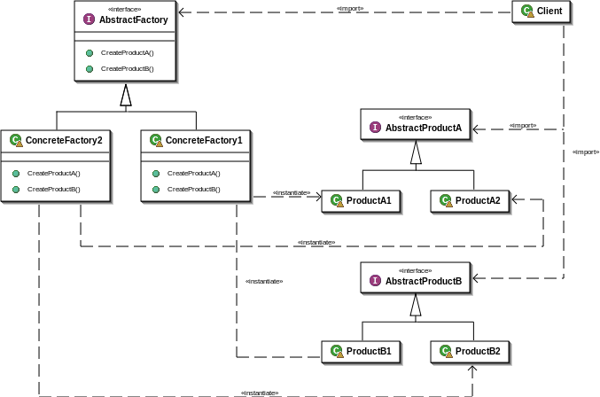

Abstract Factory
================
Provide an interface for creating families of related or dependent objects without specifying their concrete classes.

Structure
---------

Applicability
-------------
Use the Abstract Factory pattern when
* a sy stem should be independent of how its products are created, composed, and represented;
* a sy stem should be configured with one of multiple families of products;
* a family of related product objects is designed to be used together, and you need to enforce this constraint;
• y ou want to provide a class library of products, and y ou want to reveal just their interfaces, not their implementations;

Абстрактная фабрика
===================
Паттерн, порождающие объекты. Предоставляет интерфейс для создания семейств взаимосвязанных или взаимозависимых объектов, не специфицируя из конкретных классов.

Структура
---------

Применение
----------
Используйте данный паттерн, когда:
* система не должна зависеть от того, как создаются, компонуются и представляются входящие в нее объекты;
* входящие в семейство взаимосвязанные объекты должны использоваться вместе и вам необходимо обеспечить выполнение этого ограничения;
* система должна конфигурироваться одним из семейств составляющих ее объектов;
* вы хотите предоставить библиотеку объектов, раскрывая только их интерфейсы, но не реализацию.