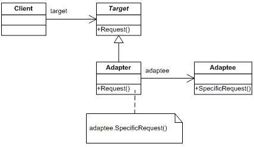

Adapter
=======
Convert the interface of a class into another interface clients expect. Adapter lets classes work together that couldn’t otherwise because of incompatible interfaces.

Structure
---------

Applicability
-------------
Use the Adapter pattern when
* you want to use an existing class, and its interface does not match the one you need.
* you want to create a reusable class that cooperates with unrelated or unforeseen classes, that is, classes that don’t necessarily have compatible interfaces.
* *(object adapter only)* you need to use several existing subclasses, but it’s impractical to adapt their interface by subclassing every one. An object adapter can adapt the interface of its parent class.

Адаптер
=======
Паттерн, структурирующий классы и объекты. Преобразует интерфейс одного класса в интерфейс другого, который ожидают клиенты. Адаптер обеспечивает совместную работу классов с несовместимыми интерфейсами, которая без него была бы невозможна.

Структура
---------

Применимость
------------
Применяйте паттерн адаптер, когда:
* хотите использовать существующий класс, но его интерфейс не соответствует вашим потребностям;
* собираетесь создать повторно используемый класс, который должен взаимодействовать с заранее неизвестными или не связанными с ним классами, имеющими несовместимые интерфейсы;
* *(только для адаптера объектов!)* нужно использовать несколько существующих подклассов, но непрактично адаптировать их интерфейсы путем порождения новых подклассов от каждого. В этом случае адаптер объектов может приспосабливать интерфейс их общего родительского класса.