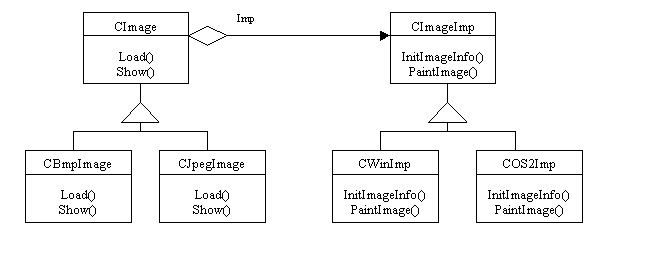

Bridge
======
Decouple an abstraction from its implementation so that the two can vary independently.

Structure
---------

Applicability
-------------
Use the Bridge pattern when:
* you want to avoid a permanent binding between an abstraction and its implementation. This might be the case, for example, when the implementation must be selected or switched at run-time;
* both the abstractions and their implementations should be extensible by subclassing. In this case, the **Bridge pattern** lets you combine the different abstractions and implementations and extend them independently;
* changes in the implementation of an abstraction should have no impact on clients; that is, their code should not have to be recompiled;
* *(C++)* you want to hide the implementation of an abstraction completely from clients. In C++ the representation of a class is visible in the class interface;
* you have a proliferation of classes. Such a class hierarchy indicates the need for splitting an object into two parts;
* you want to share an implementation among multiple objects (perhaps using reference counting), and this fact should be hidden from the client.

Мост
====
Паттерн, структурирующий объекты. Отделяет абстракцию от ее реализации так, чтобы то и другое можно было изменять независимо.

Структура
---------

Применимость
------------
Используйте паттерн мост, когда:
* хотите избежать постоянной привязки абстракции к реализации. Так, например, бывает, когда реализацию необходимо выбирать во время выполнения программы;
* и абстракции, и реализации должны расширяться новыми подклассами. В таком случае паттерн **мост** позволяет комбинировать разные абстракции и реализации и изменять из независимо;
* изменения в реализации абстракции не должны сказываться на клиентах, то есть клиентский код не должен перекомпилироваться;
* *(только для С++)* вы хотите полностью скрыть от клиентов реализацию абстракции. В С++ представление класса видимо через его интерфейс;
* число классов начинает быстро расти. Это признак того, что иерархию следует разделить на две части;
* вы хотите разделить одну реализацию между несколькими объектами (быть может, применяя подсчет ссылок), а этот фат необходимо скрыть от клиента.