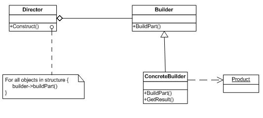

Builder
=======
Separate the construction of a complex object from its representation so that the same construction process can create different representations.

Structure
---------

Applicability
-------------
Use the Builder pattern when:
* the algorithm for creating a complex object should be independent of the parts that make up the object and how they’re assembled.
* the construction process must allow different representations for the object that’s constructed.

Строитель
=========
Отделяет конструирование сложного объекта от его представления, так что в результате одного и того же процесса конструирования могут получаться разные представления.

Структура
---------

Применимость
------------
Используйте паттерн строитель, когда:
* алгоритм сложного объекта не должне зависеть от того, из каких частей состоят объект и как они стыкуются между собой;
* процесс конструирования должен обеспечивать различные представления конструируемого объекта.