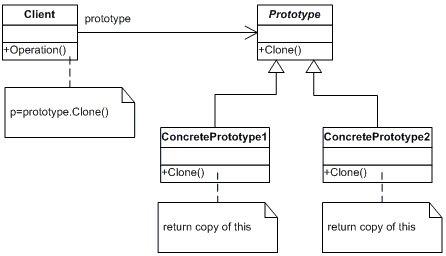

Prototype
=========
Specify the kinds of objects to create using a prototypical instance, and create new objects by copying this prototype.

Structure
---------

Applicability
------------- 
Use the Prototype pattern when a system should be independent of how its products are created, composed, and represented; and
* when the classes to instantiate are specified at run-time, for example, by dynamic loading; **or**
* to avoid building a class hierarchy of factories that parallels the class hierarchy of products; **or**
* when instances of a class can have one of only a few different combinations of state. It may be more convenient to install a corresponding number of prototypes and clone them rather than instantiating the class manually, each time with the appropriate state.

Прототип
========
Задает виды создаваемых объектов с помощью экземпляра-прототипа и создает новые объекты путем копирования этого прототипа.

Структура
---------

Применимость
------------
Используйте паттерн **прототип**, когда система не должна зависеть от того, как в ней создаются, компонуются и представляются продукты:
* инстанцируемые классы определяются во время выполнения, например, с помощью динамической загрузки;
* для того, чтобы избежать построения иерархий классов или фабрик, параллельных иерархии классов продуктов;
* экземпляры класса могут находиться в одном из не очень большого числа различных состояний. Может оказаться удобнее установить соответствующее число прототипов и клонировать их, а не инстанцировать каждый раз класс вручную в подходящем состоянии.